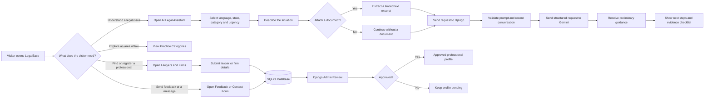
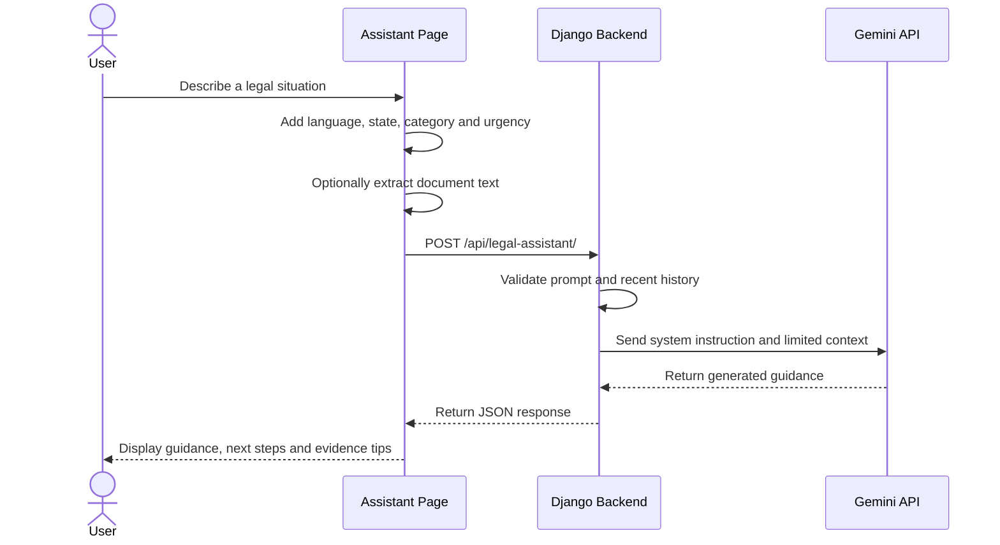
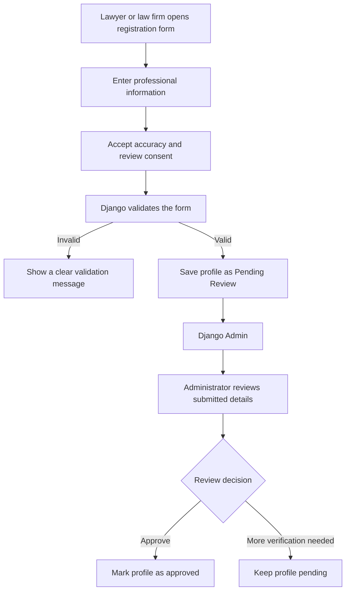
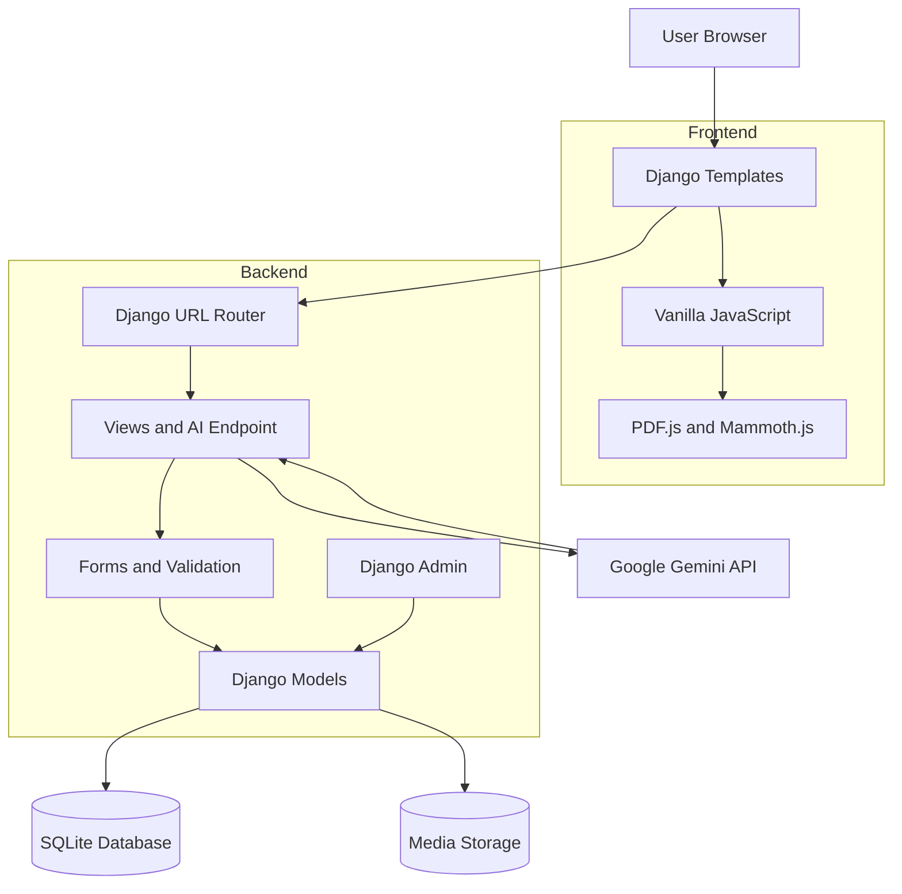

<div align="center">

# ⚖️ LegalEase

### AI-powered preliminary legal guidance, evidence organisation, and lawyer discovery

A Django-based legal-tech prototype that helps users understand a legal situation, prepare useful information, preserve evidence, and identify the right type of legal professional.

[](https://www.python.org/)
[](https://www.djangoproject.com/)
[](https://ai.google.dev/)
[](https://www.sqlite.org/)


[Overview](#-overview) •
[Features](#-key-features) •
[How It Works](#-how-legalease-works) •
[Installation](#-installation) •
[Review Guide](#-how-to-review-the-project) •
[Security](#-security-and-privacy) •
[Roadmap](#-roadmap)

</div>

---

> [!IMPORTANT]
> LegalEase provides **preliminary educational legal information only**. It is not a law firm, does not create a lawyer-client relationship, and must not replace advice from a qualified lawyer, court, police authority, emergency service, or official legal-aid provider.

## 🚀 Overview

Legal problems often become confusing before a person even speaks with a lawyer.

Users may not know:

- what information is important;
- which documents, messages, screenshots, or recordings should be preserved;
- whether the situation may require urgent action;
- which area of law is relevant;
- what practical step they should take next;
- what information they should prepare before contacting a professional.

**LegalEase helps organise that first stage.**

Instead of presenting users with complex legal language, the platform guides them through a structured process:

1. Select the preferred language, location, legal category, and urgency.
2. Describe the situation in plain language.
3. Optionally attach a supported document.
4. Receive a structured preliminary response.
5. Review practical next steps and an evidence checklist.
6. Explore the relevant practice area.
7. Find or register a lawyer or law firm.

---

## 💡 Why This Project Matters

LegalEase is designed around a simple idea:

> Move the user from **confusion** to a more **organised understanding** of their legal situation.

### The platform helps users:

- 📝 explain an issue in their own words;
- 🧭 identify a possible legal category;
- 📍 provide state or Union Territory context;
- 🚨 indicate urgency;
- 📂 organise documents and supporting evidence;
- ✅ receive practical next-step guidance;
- 👨‍⚖️ understand what type of legal professional may be relevant;
- 🏛️ submit lawyer or law-firm profiles for administrative review.

---

## ✨ Key Features

| Feature | What it does |
|---|---|
| 🤖 **AI Legal Assistant** | Converts a user’s description into plain-language preliminary guidance, practical steps, and an evidence checklist. |
| 🇮🇳 **India-focused Context** | Uses the selected state/UT, legal category, urgency, and preferred response language as contextual information. |
| 🌐 **Multilingual Interface** | Supports English, Hindi, Hinglish, Marathi, Bengali, Gujarati, and Punjabi selections. |
| 📄 **Document-assisted Questions** | Reads supported files in the browser and includes a limited excerpt with the legal question. |
| 🔊 **Accessible Responses** | Includes text-to-speech, copy controls, dark mode, and conversation export. |
| ⚖️ **Practice-area Discovery** | Introduces users to criminal, civil, family, corporate, tax, and cybercrime categories. |
| 👨‍⚖️ **Professional Registration** | Allows lawyers and law firms to submit professional information through a structured form. |
| ✅ **Django Admin Review** | Stores new registrations as pending and allows an administrator to review and approve them. |
| 💬 **Feedback and Contact Forms** | Stores ratings, messages, documents, images, and supported feedback videos. |
| 🛡️ **Server-side AI Integration** | Sends Gemini requests through Django so the API key is not exposed in frontend JavaScript. |

---

## 🔄 How LegalEase Works

### Complete User Journey



### AI Request Sequence



### Professional Registration Flow



---

## 🏗️ System Architecture



---

## 🧰 Technology Stack

| Layer | Technology |
|---|---|
| **Backend** | Python, Django 6.0.7 |
| **Frontend** | Django Templates, HTML5, CSS3, Vanilla JavaScript |
| **AI Integration** | Google Gemini API through a server-side Django endpoint |
| **Database** | SQLite for local development |
| **File Handling** | Django media storage, extension validation, and upload checks |
| **Document Reading** | PDF.js and Mammoth.js in the browser |
| **Administration** | Django Admin |
| **Icons** | Font Awesome |
| **Typography** | Inter and Playfair Display |

---

## 🗺️ Main Pages and Routes

| Route | Purpose |
|---|---|
| `/` | Homepage, legal categories, feedback form, and contact form |
| `/assistant/` | AI-powered preliminary legal-information assistant |
| `/api/legal-assistant/` | Server-side POST endpoint used by the assistant |
| `/lawyers/` | Lawyer discovery and professional registration |
| `/admin/` | Django Admin for feedback and professional review |
| `/AI` | Legacy redirect to `/assistant/` |
| `/blog` | Legacy redirect to `/lawyers/` |

---

## 📁 Project Structure

```text
LegalEase-AI-legal-assistant/
├── LegalEase/
│   ├── main.py                 # Page views and Gemini API endpoint
│   ├── settings.py             # Django and environment settings
│   ├── urls.py                 # Application routes
│   ├── tests.py                # Core route and API tests
│   ├── asgi.py
│   └── wsgi.py
│
├── legal/
│   ├── admin.py                # Feedback and contact administration
│   ├── forms.py                # Submission and upload validation
│   ├── models.py               # Feedback and contact model
│   ├── migrations/
│   └── tests.py
│
├── register/
│   ├── admin.py                # Professional review workflow
│   ├── forms.py                # Lawyer and firm validation
│   ├── models.py               # Professional registration model
│   ├── migrations/
│   └── tests.py
│
├── template/
│   ├── index.html              # Homepage
│   ├── assistant.html          # AI assistant interface
│   └── lawyers.html            # Lawyer and firm page
│
├── static/                     # Project-owned static assets
├── media/                      # Local uploads; ignored by Git
├── .gitignore
├── requirements.txt
├── setup_windows.bat
├── run_windows.bat
└── manage.py
```

---

# 💻 Installation

## Prerequisites

Install the following before starting:

- **Python 3.12 or newer**
- **Git**
- A modern web browser
- A **Google Gemini API key** for live AI responses

---

## 1. Clone the Repository

```bash
git clone https://github.com/mohithakur0602/LegalEase-AI-legal-assistant.git
cd LegalEase-AI-legal-assistant
```

---

## 2. Create the Environment Configuration

Create a file named `.env` in the project root:

```env
DJANGO_SECRET_KEY=replace-this-with-a-long-random-secret
DJANGO_DEBUG=True
DJANGO_ALLOWED_HOSTS=127.0.0.1,localhost
DJANGO_CSRF_TRUSTED_ORIGINS=

GEMINI_API_KEY=replace-with-your-gemini-api-key
GEMINI_MODEL=gemini-2.5-flash
GEMINI_TIMEOUT_SECONDS=35
```

> [!CAUTION]
> Never commit `.env`, API keys, private legal information, uploaded identity documents, or a database containing personal information.

---

## 3A. Quick Windows Setup

The repository includes Windows helper scripts.

### First-time setup

```bat
setup_windows.bat
```

The setup script will:

- create the `env` virtual environment;
- install the project requirements;
- apply database migrations;
- prepare the project for local use.

Create an administrator account:

```bat
env\Scripts\python manage.py createsuperuser
```

Start the application:

```bat
run_windows.bat
```

---

## 3B. Manual Setup — PowerShell

```powershell
py -m venv env
env\Scripts\Activate.ps1

python -m pip install --upgrade pip
python -m pip install -r requirements.txt

python manage.py migrate
python manage.py createsuperuser
python manage.py runserver
```

---

## 3C. Manual Setup — Git Bash

```bash
py -m venv env
source env/Scripts/activate

python -m pip install --upgrade pip
python -m pip install -r requirements.txt

python manage.py migrate
python manage.py createsuperuser
python manage.py runserver
```

---

## 3D. Manual Setup — Linux or macOS

```bash
python3 -m venv env
source env/bin/activate

python -m pip install --upgrade pip
python -m pip install -r requirements.txt

python manage.py migrate
python manage.py createsuperuser
python manage.py runserver
```

---

## 4. Open the Project

Open the public application:

```text
http://127.0.0.1:8000/
```

Open Django Admin:

```text
http://127.0.0.1:8000/admin/
```

---

# 🔍 How to Review the Project

A recruiter, developer, teacher, or contributor can use the following review process.

## Step 1 — Clone and prepare the project

```bash
git clone https://github.com/mohithakur0602/LegalEase-AI-legal-assistant.git
cd LegalEase-AI-legal-assistant
```

Create and activate a virtual environment, install the requirements, and configure `.env`.

## Step 2 — Run Django checks

```bash
python manage.py check
```

Expected result:

```text
System check identified no issues.
```

## Step 3 — Run automated tests

```bash
python manage.py test
```

Review whether:

- the homepage opens correctly;
- the assistant route loads;
- the lawyers route loads;
- legacy redirects work;
- invalid AI requests are rejected;
- forms validate expected input;
- database records are created correctly.

## Step 4 — Run the development server

```bash
python manage.py runserver
```

## Step 5 — Review the main user journeys

### Homepage review

- Open `/`.
- Submit feedback.
- Submit a contact message.
- Test supported attachments.
- Confirm success and validation messages.

### AI assistant review

- Open `/assistant/`.
- Select a language, location, category, and urgency.
- Ask a legal-information question.
- Attach a supported document.
- Check the response structure.
- Test copy, text-to-speech, dark mode, and export controls.

### Professional registration review

- Open `/lawyers/`.
- Submit a lawyer profile.
- Submit a law-firm profile.
- Confirm the registration is saved as pending.
- Open `/admin/`.
- Review and approve the submitted profile.

### Security review

- Confirm `.env` is ignored by Git.
- Confirm the Gemini key is not present in frontend JavaScript.
- Test CSRF-protected forms.
- Test oversized or unsupported uploads.
- Test empty and excessively long AI requests.
- Confirm public pages do not expose private email addresses or phone numbers.

---

# ⚙️ Environment Variables

| Variable | Purpose |
|---|---|
| `DJANGO_SECRET_KEY` | Private Django cryptographic secret |
| `DJANGO_DEBUG` | Enables or disables debug mode |
| `DJANGO_ALLOWED_HOSTS` | Comma-separated domains or IP addresses allowed to serve the application |
| `DJANGO_CSRF_TRUSTED_ORIGINS` | Trusted HTTPS origins used during deployment |
| `GEMINI_API_KEY` | Private Google Gemini API key used by Django |
| `GEMINI_MODEL` | Gemini model used by the legal assistant |
| `GEMINI_TIMEOUT_SECONDS` | Maximum time Django waits for the AI service |

When no Gemini API key is configured, the live Gemini response is unavailable.

---

# 🛠️ Django Admin Workflow

## Feedback and contact management

Administrators can:

- review feedback and contact submissions;
- filter records by submission type, rating, and date;
- search by name, email, or message;
- preview supported images and videos;
- open other supported attachments;
- review submissions in reverse chronological order.

## Professional registration management

Administrators can:

- search by professional name, registration ID, email, phone, city, or practice area;
- filter lawyers and firms by approval status;
- review submitted credentials and profile information;
- approve professional profiles through Django Admin;
- keep incomplete profiles pending for additional verification.

---

# 🔐 Security and Privacy

LegalEase includes several responsible implementation choices:

- Gemini requests are sent through Django.
- The Gemini API key is not placed in frontend JavaScript.
- CSRF protection is used for forms and the assistant endpoint.
- Empty, malformed, and excessively long AI requests are rejected.
- Conversation history is limited before it is sent to the AI service.
- File extensions and upload sizes are validated.
- Professional phone numbers and email addresses are not directly rendered on public profile cards.
- New professional registrations are marked as pending.
- `.env`, local databases, uploaded media, and virtual environments are excluded from Git.

## Before a public production deployment

Complete the following work:

- [ ] Set `DJANGO_DEBUG=False`.
- [ ] Use a strong production `DJANGO_SECRET_KEY`.
- [ ] Restrict `DJANGO_ALLOWED_HOSTS`.
- [ ] Configure `DJANGO_CSRF_TRUSTED_ORIGINS`.
- [ ] Use HTTPS.
- [ ] Move from SQLite to PostgreSQL.
- [ ] Store uploads in secure object storage.
- [ ] Add MIME-type and content validation for uploads.
- [ ] Add rate limiting to the AI endpoint.
- [ ] Add structured logging and error monitoring.
- [ ] Display only approved professional profiles publicly.
- [ ] Add privacy, consent, retention, and deletion policies.
- [ ] Complete a legal and privacy review before collecting real case information.

---

# ✅ Checks and Tests

Run Django system checks:

```bash
python manage.py check
```

Run automated tests:

```bash
python manage.py test
```

Create migrations after model changes:

```bash
python manage.py makemigrations
python manage.py migrate
```

Check pending migrations:

```bash
python manage.py makemigrations --check
```

---

# 📸 Screenshots

Add screenshots inside a directory such as:

```text
docs/screenshots/
├── homepage.png
├── assistant.png
├── lawyers.png
└── admin.png
```

Then add this gallery to the README:

```markdown
| Homepage | AI Assistant |
|---|---|
|  |  |

| Lawyers and Firms | Django Admin |
|---|---|
|  |  |
```

A short demonstration video or animated GIF will make the repository much more attractive to recruiters and contributors.

---

# 🧭 Roadmap

## Priority 1 — Privacy and verification

- [ ] Show only approved professionals on public pages.
- [ ] Keep pending applications visible only in Django Admin.
- [ ] Add verified-professional profile pages.
- [ ] Add a documented privacy and data-retention policy.
- [ ] Add stronger file-content validation.

## Priority 2 — Product features

- [ ] User accounts and saved consultations.
- [ ] Lawyer login and profile management.
- [ ] Appointment-request workflow.
- [ ] Email notifications for registrations and feedback.
- [ ] Public display of verified professionals.
- [ ] Official legal-resource links managed from Django Admin.

## Priority 3 — Production engineering

- [ ] PostgreSQL support.
- [ ] AI endpoint rate limiting.
- [ ] Structured logging and monitoring.
- [ ] Automated CI checks.
- [ ] Deployment documentation.
- [ ] Docker support.
- [ ] Expanded unit and integration tests.
- [ ] Accessibility testing.

---

# 🤝 Contributing

Contributions that improve accessibility, validation, documentation, test coverage, security, or responsible legal-information design are welcome.

## Contribution steps

1. Fork the repository.
2. Create a new branch.

```bash
git checkout -b feature/your-improvement
```

3. Make and test your changes.

```bash
python manage.py check
python manage.py test
```

4. Commit your changes.

```bash
git add .
git commit -m "Add your improvement"
```

5. Push the branch.

```bash
git push origin feature/your-improvement
```

6. Open a pull request explaining:

- what changed;
- why the change was required;
- how the change was tested;
- whether it affects user data, security, uploads, or AI behaviour.

## Do not commit

- API keys or `.env` files;
- real client or legal-case information;
- uploaded identity documents;
- databases containing personal information;
- virtual environments;
- generated media files.

---

# ⚠️ Legal Disclaimer

LegalEase is an educational software project.

AI-generated responses may be incomplete, outdated, or incorrect. They must not be treated as a final legal opinion. Laws, procedures, deadlines, and remedies can vary according to the facts, date, location, and applicable authority.

For immediate danger, violence, a medical emergency, or an urgent threat, contact the appropriate emergency service or a trusted person nearby.

For a real legal matter, verify important information with:

- a qualified lawyer;
- an official government authority;
- a court or police authority where appropriate;
- a recognised legal-aid provider.

---

# 📄 Licence

A licence has not yet been added to this repository.

Before accepting external contributions or allowing unrestricted reuse, add an appropriate `LICENSE` file and update this section.

---

<div align="center">

### Built as a practical Django legal-tech project

Focused on clarity, safety, accessibility, structured legal-information preparation, and responsible AI usage.

⭐ Star the repository if you find LegalEase useful.

</div>
